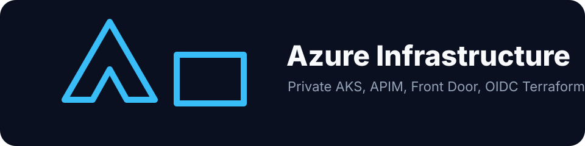

# azure-infrastructure




Enterprise Azure infrastructure using Terraform. Hub-spoke topology, private AKS, APIM behind Front Door Premium, Service Bus Premium, and centralized Key Vault: all provisioned via OIDC-authenticated GitHub Actions with no stored service principal secrets.

Commercial angle and consulting hooks: [docs/go-to-market.md](docs/go-to-market.md).

> All company-specific values (subscription IDs, tenant IDs, resource names, CIDR blocks, hostnames) are replaced with `PLACEHOLDER_*` values.

---

## Architecture

```
               +--------------------------------------------------+
               |           Azure Front Door Premium               |
               |      WAF: OWASP 3.2 + BotManager rules           |
               +----------------------+---------------------------+
                                      | Private Link
               +----------------------+---------------------------+
               |       APIM (Internal VNet mode)                  |
               |   JWT validation  |  Key Vault named values      |
               +--------+-----------+----------------------------+
                        |                       |
           +------------+--------+   +----------+----------+
           |     AKS Cluster     |   |   Service Bus        |
           |  (private API svr)  |   |   Premium + PE       |
           +---------------------+   +---------------------+
                    |
        +-----------+-----------+
        |       Hub VNet        |
        |  Azure Firewall Prem  |
        |  Bastion (Standard)   |
        +-----------+-----------+
               |    |    |
        +------+  +-+-+  +------+
        | AKS  |  |API|  | Data |
        | Spoke|  |Spk|  | Spk  |
        +------+  +---+  +------+
```

---

## Design decisions

**Hub-spoke over full mesh**: At n spokes, full mesh requires n*(n-1)/2 peering connections and each spoke manages routes to every other spoke. Hub-spoke centralizes east-west traffic through Azure Firewall Premium (IDPS + application layer inspection). Adding a new spoke is one peering pair, not n-1.

**APIM Internal VNet + Front Door Premium**: APIM has no routable public IP. Front Door Premium reaches the APIM internal VIP via Private Link, so the gateway is only reachable after passing the WAF layer. The common alternative (APIM on a public IP behind IP allowlisting) fails when IPs rotate.

**Private AKS cluster**: The API server endpoint is a private endpoint inside the hub VNet. Operators connect via Bastion → jump VM → kubectl. Even a misconfigured NSG cannot expose the API server to the internet.

**Azure CNI Overlay over classic Azure CNI**: Classic Azure CNI allocates pod IPs from the VNet subnet, exhausting a /22 at roughly 200 nodes. CNI Overlay keeps pod IPs in a separate overlay CIDR (/16) that does not consume VNet address space, while nodes retain VNet IPs for subnet-scoped network policies.

**Workload Identity over pod-managed identity (NMI)**: MSI used an in-cluster DaemonSet (NMI) that intercepted all IMDS traffic on port 2579. An SSRF vulnerability in any pod could reach the IMDS endpoint and escalate to the node-level managed identity. Workload Identity issues federated OIDC tokens scoped to specific Kubernetes ServiceAccounts: a compromised pod can only access the identity explicitly assigned to its ServiceAccount.

**Key Vault RBAC over access policies**: Access policies predate Azure RBAC and do not integrate with Conditional Access, PIM, or Azure Policy audit. `enable_rbac_authorization = true` means Key Vault access goes through the same role pipeline as every other Azure resource: auditable, PIM-eligible, and enforceable via Policy deny effects.

---

## Repository layout

```
landing-zone/
  management-groups/   Tenant root -> Org -> Platform / Workloads / Sandbox hierarchy
  policies/            Deny KV public access, deny AKS privileged, allowed locations

platform/
  hub-network/         Hub VNet + Firewall Premium + Bastion + spoke VNets + private DNS zones
  monitoring/          Log Analytics workspace + Application Insights + action groups

workloads/
  aks-platform/        Private AKS: CNI Overlay, Workload Identity, Defender, OMS, KVSP
  api-platform/        APIM Internal VNet + Front Door Premium + Key Vault RBAC
  messaging/           Service Bus Premium + private endpoint + DLQ alerts

pipelines/
  github-actions/
    terraform-plan.yml    OIDC auth, matrix plan per workspace, posts diff to PR
    terraform-apply.yml   OIDC auth, serialized apply, production environment gate
```

---

## Deployment order

```
1. landing-zone/management-groups    (once per tenant)
2. landing-zone/policies             (once per tenant)
3. platform/hub-network              (connectivity subscription)
4. platform/monitoring               (management subscription)
5. workloads/aks-platform            (workloads subscription)
6. workloads/api-platform            (workloads subscription)
7. workloads/messaging               (workloads subscription)
```

Workloads depend on hub-network output (VNet IDs, subnet IDs) and monitoring output (Log Analytics workspace ID) via `terraform_remote_state`.

---

## GitHub Actions OIDC: no stored secrets

The service principal authenticates via federated identity credentials. No `AZURE_CLIENT_SECRET` is stored.

```bash
# Create app registration and service principal
az ad app create --display-name "PLACEHOLDER_SP_NAME"
az ad sp create --id <app-id>

# Assign Contributor at subscription scope (tighten per workspace in prod)
az role assignment create \
  --role Contributor \
  --assignee <sp-object-id> \
  --scope /subscriptions/PLACEHOLDER_SUBSCRIPTION_ID

# Federated credential for main branch pushes
az ad app federated-credential create \
  --id <app-id> \
  --parameters '{
    "name": "github-main",
    "issuer": "https://token.actions.githubusercontent.com",
    "subject": "repo:PLACEHOLDER_GH_ORG/azure-infrastructure:ref:refs/heads/main",
    "audiences": ["api://AzureADTokenExchange"]
  }'

# Federated credential for PR plans
az ad app federated-credential create \
  --id <app-id> \
  --parameters '{
    "name": "github-pr",
    "issuer": "https://token.actions.githubusercontent.com",
    "subject": "repo:PLACEHOLDER_GH_ORG/azure-infrastructure:pull_request",
    "audiences": ["api://AzureADTokenExchange"]
  }'
```

Set `AZURE_CLIENT_ID` and `AZURE_TENANT_ID` as repository secrets. The pipeline uses `azure/login@v2` with `use-oidc: true`.
